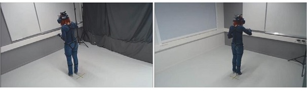
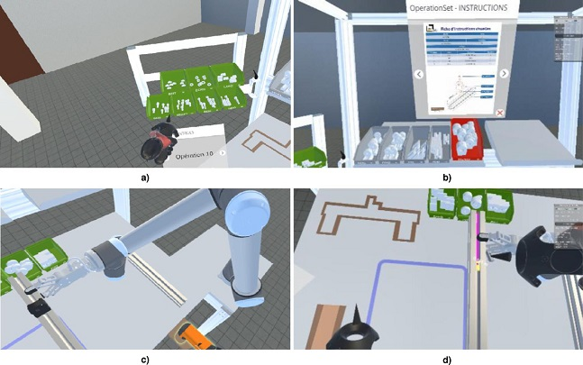
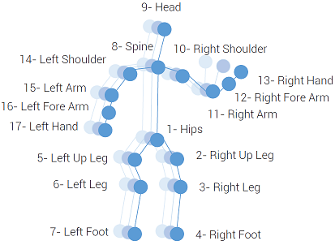

# InHARD-DT - Industrial Human Action Recognition Dataset - Digital Twin

## Description
This paper explores the use of a Digital Twin of a real industrial workstation involving assembly tasks with a robotic arm interfaced with Virtual Reality (VR) to extract a digital human model. The DT simulates assembly operations performed by humans aiming to generate self-labeled data. Thereby, a Human Action Recognition dataset named InHARD-DT was created to validate a real use case in which we use the acquired auto-labeled DT data of the virtual representation of the InHARD dataset to train a Spatial–Temporal Graph Convolutional Neural Network with skeletal data on one hand. On the other hand, the Physical Twin (PT) data of the InHARD dataset was used for testing. Therefore, we introduce a RGB+S dataset named “Industrial Human Action Recognition Dataset - Digital Twin” (InHARD-DT) from a real-world setting for industrial human action recognition. 

We invited 12 distinct subjects from the LINEACT laboratory (4 females and 8 males) for the DT data collection to perform the same assembly tasks of the InHARD dataset (link below) in Virtual Reality via a VR application of an industrial real workstation. This dataset contains 13 different industrial action classes and over 4800 action samples. The introduction of this dataset should allow us the study and development of various learning techniques for the task of human actions analysis inside industrial environments involving human robot collaborations. It can be used also in cross-validation scenarios where the training phase can be done using the Physical Twin (PT) data of the InHARD dataset (real world scenarios) and then test using Digital Twin (DT) data of the InHARD-DT dataset which is the main objective of this paper. 

**Paper link : http://dx.doi.org/10.1016/j.engappai.2022.105655**




## Download
The dataset can be downloaded from this link : ```upload in progress...```

## Data Modalities  
### Skeleton modality 
We used a “Combination Perception Neuron 32 Edition v2” motion sensor to capture the skeletal data delivered at a frequency of 120 Hz.  
Skeleton data comprises :
* The 3D locations (Tx, Ty and Tz) of 17 major body joints
* The 3 rotations around each axis (Rx, Ry and Rz)  
Skeleton data are saved into **BVH format** files and are stored in the **Skeleton/ folder** of the InHARD-DT dataset.  

<p align="center">
	
</p>

To manipulate BVH files, we recommand using the [PyMO python library](https://github.com/omimo/PyMO/)

### Video modality
We used 2 C920 cameras to capture RGB Data. Each camera captures three different views of the same action. For each setup, two cameras were placed at the same height but at two different horizontal angles: -45° and +45° to capture both left and right sides. 

* Camera 1 observes left side views and is shown on the top right quarter of the RGB video. 
* Camera 2 observes right side views and is displayed on the bottom right quarter of the RGB video as shown in figure above

RGB files are stored in the **RGB/Videos folder** of the InHARD-DT dataset. The rendered videos of the assembly tasks in the VR application are stored in the **RGB/VR folder**.

**PS** : Please note that the VR videos are not cut and are added just to better understand the concept of the workflow in the VR application.

## Dataset usage
The InHARD-DT dataset can be used for both online and segmented action recognition scenarios. Therefore for each scenario, both RGB and Skeleton data are provided. 

## Action Classes
To label the operators actions during the assembly task, we assigned each component, sub-system, system or any object involved in the assembly task to a specific triggering event activated once the operator interacts with them using the controllers. Thus, each performed action has its own mean of detection. In the Table below, we detail all the preset actions and their respective means of detection.

| Event | Action ID | Means of detection | 
|:-------------:|:-------------:|:-----------------------------:|
| Assemble system start| 0 | When the preview of an assembling is displayed. | 
| Assemble system end  | 1 | When a part is assembled with an object. | 
| Consult sheets start | 2 | When the gaze of the headset rests on a sheet for more than 300 ms. |
| Consult sheet end | 3 | When the gaze of the headset rests on the sheets less than 300 ms. |
| Picking in front high | 4 | When a part is taken from a box on the upper part of the workstation. |
| Picking in front low  | 5 | When a component is taken from a box on the lower part of the workstation. |
| Picking left | 6 | When a part is taken from a box on the left side of the workstation. |
| Put down component | 7 | When a component is placed on the table. |
| Put down measuring rod | 8 | When the measuring rod is returned to its original location. |
| Put down screwdriver | 9 | When the screwdriver is returned to its original location. |
| Put down subsystem | 10 | When the P360 part from Operation 1 is placed on the table. |
| Robot step | 11 | When the robot goes to another step by pressing the previous or next button. |
| Take component | 12 | When a part is retrieved from the table. |
| Take measuring rod | 13 | When the measuring rod is grabbed. |
| Take screwdriver | 14 | When the screwdriver is grabbed. |
| Take subsystem | 15 | When the P360 part is grabbed from its location on the table. |
| Turn sheets | 16 | When the sheets are turned by pressing the previous or next button. |
| Sync | 17 | When the ESC button is pressed (Used to synchronize videos and BVH files). |

## Subjects
We invited 12 distinct subjects from our laboratory (4 females and 8 males) for the DT data collection to perform the assembly tasks in the rendered VR application of the industrial workstation. The subjects were a mix between experts and beginners based on their handling and expertise with the assembly workflow. The ages of the subjects ranged between 25 and 45.

For each sequence, you will find a **.csv** file stored in the **CSV/ folder** that provides the sequence name, action class, action number and action start and end times.
See an extract below:  

| Respondent | Action | Action_number | Action_start | Action_end |
|:-------------:|:-------------:|:-----------------------------:|:-------------:|:-------------:|
| LMVR_1_Alexandra_Manip | Consult sheets | 1 | 41.6412 | 45.7429
| LMVR_1_Alexandra_Manip | Picking left | 3 | 41.8339 | 45.3339
| LMVR_1_Alexandra_Manip | Assemble system | 0 | 50.0719 | 60.5766
| LMVR_1_Alexandra_Manip | Picking in front | 2 | 63.8237 | 66.8237
| LMVR_1_Alexandra_Manip | Assemble system | 0 | 79.0068 | 81.1070

## InHARD dataset
Please follow this link to access the InHARD dataset : https://github.com/vhavard/InHARD

## Citation
``` 
@article{DALLEL2023105655,
title = {Digital twin of an industrial workstation: A novel method of an auto-labeled data generator using virtual reality for human action recognition in the context of human–robot collaboration},
journal = {Engineering Applications of Artificial Intelligence},
volume = {118},
pages = {105655},
year = {2023},
issn = {0952-1976},
doi = {https://doi.org/10.1016/j.engappai.2022.105655},
url = {https://www.sciencedirect.com/science/article/pii/S0952197622006455},
author = {Mejdi Dallel and Vincent Havard and Yohan Dupuis and David Baudry},
keywords = {Digital Twins (DTs), Industry 4.0, Auto-labeled data generation, Virtual Reality (VR), Human Action Recognition (HAR), Human–Robot Collaboration (HRC)},
abstract = {The recognition of human actions based on artificial intelligence methods to enable Human–Robot Collaboration (HRC) inside working environments remains a challenge, especially because of the necessary huge training datasets needed. Meanwhile, Digital Twins (DTs) of human centered productions are increasingly developed and used in the design and operation phases. As instance, DTs are already helping industries to design, visualize, monitor, manage, and maintain their assets more effectively. However, few works are dealing with using DTs as a dataset generator tool. Therefore, this paper explores the use of a DT of a real industrial workstation involving assembly tasks with a robotic arm interfaced with Virtual Reality (VR) to extract a digital human model. The DT simulates assembly operations performed by humans aiming to generate self-labeled data. Thereby, a Human Action Recognition dataset named InHARD-DT was created to validate a real use case in which we use the acquired auto-labeled DT data of the virtual representation of the InHARD dataset to train a Spatial–Temporal Graph Convolutional Neural Network with skeletal data on one hand. On the other hand, the Physical Twin (PT) data of the InHARD dataset was used for testing. Obtained results show the effectiveness of the proposed method.}
}
```